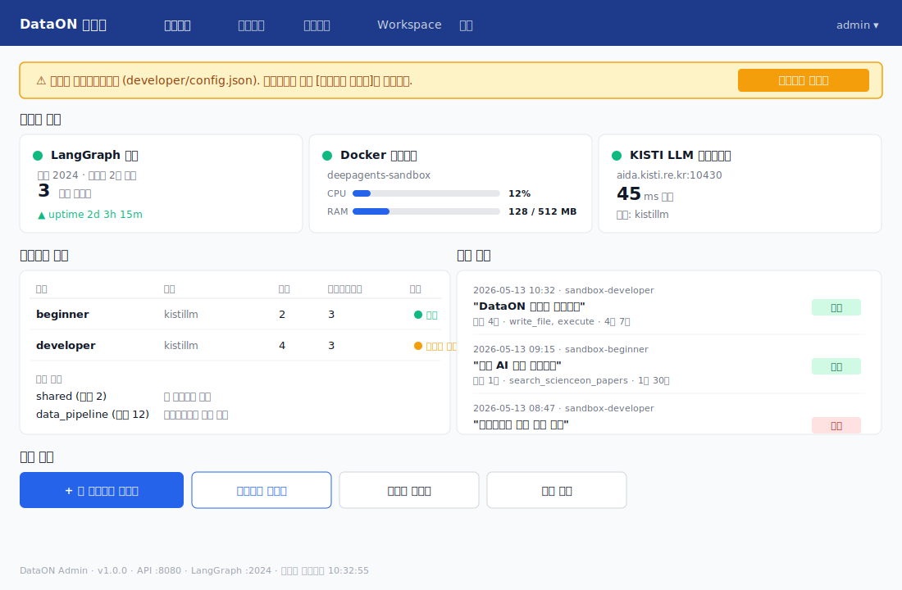
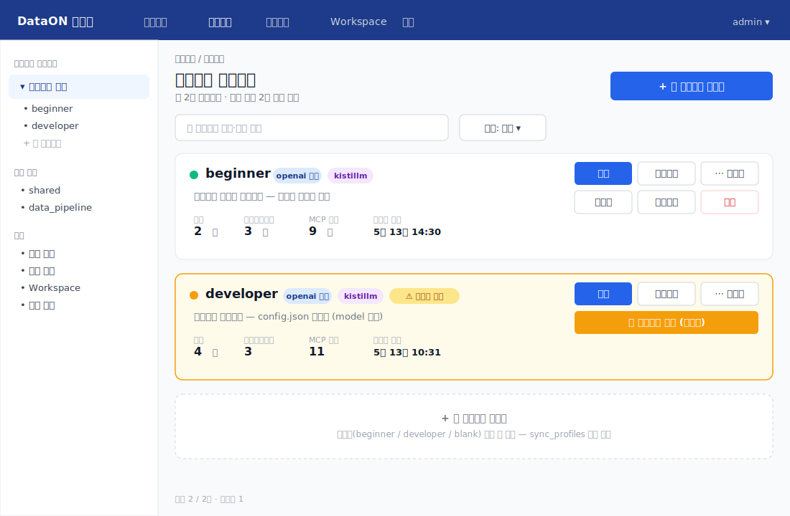
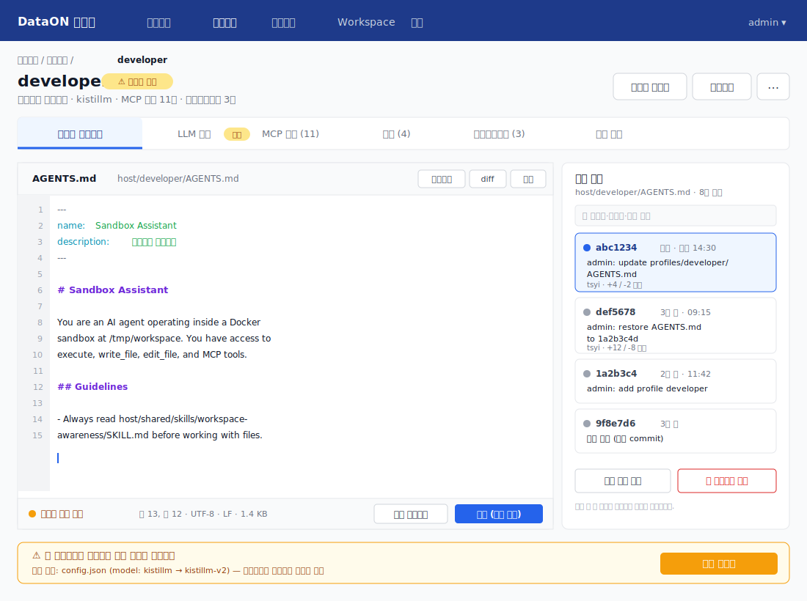

# DataON 에이전트 관리 시스템 (Admin UI) — 설계 문서

---

## 1. 개요

### 1.1 목적

DataON 에이전트의 구성 파일(`host/` 디렉토리)과 운영 상태를 웹 브라우저에서 관리하는 **관리자 전용 Web UI 시스템**입니다. 서버 SSH 접속 없이 에이전트 프로파일·스킬·서브에이전트 추가/수정/삭제와 운영 모니터링을 수행할 수 있습니다.

### 1.2 관리 대상

```
host/
├── {profile}/          ← 에이전트 프로파일 (beginner, developer, ...)
│   ├── AGENTS.md       ← 시스템 프롬프트
│   ├── config.json     ← LLM 모델 설정
│   ├── tools.json      ← MCP 도구 설정
│   ├── skills/         ← 프로파일 전용 스킬
│   └── subagents/      ← 서브에이전트
│       └── {name}/
│           ├── AGENTS.md
│           ├── config.json
│           ├── tools.json
│           └── skills/ ← 서브에이전트 전용 스킬
├── shared/             ← 공유 라이브러리 및 스킬 (모든 에이전트 노출)
│   ├── lib/
│   ├── src/
│   └── skills/
└── data_pipeline/      ← 데이터 파이프라인 스킬·라이브러리
    ├── lib/
    ├── src/
    └── skills/
workspace/              ← 에이전트 작업 디렉토리 (조회 전용)
```

### 1.3 기능 범위

| 기능 영역 | 세부 기능 |
|-----------|-----------|
| 프로파일 관리 | 추가·수정·삭제·조회, config/tools/AGENTS.md 편집, 다운로드 |
| 스킬 관리 | 프로파일·서브에이전트·shared·data_pipeline 스킬 CRUD |
| 서브에이전트 관리 | 추가·수정·삭제, config/tools/AGENTS.md 편집, 스킬 관리 |
| 공통 도구 관리 | shared/data_pipeline 파일 트리 탐색·편집·업로드·다운로드 |
| Workspace 조회 | 파일 트리 탐색·파일 내용 조회·다운로드 |
| 실행 로그 | LangGraph 스레드 이력, 도구 호출 시퀀스 조회 |
| 가동 상태 | LangGraph 서버·Docker 컨테이너·LLM 엔드포인트 상태 |
| 버전 관리 | git 기반 — 저장 시 자동 커밋, 이력 조회, 특정 버전 복원 |
| 에이전트 제어 | 프로파일 동기화(`sync_profiles.py`), 서비스 재시작 |

---

## 2. 시스템 아키텍처

```
┌──────────────────────────────────────────────────────────────────┐
│  브라우저                                                          │
│  Admin Web UI (React SPA)                                        │
│  http://server:8080                                              │
└──────────────────────────┬───────────────────────────────────────┘
                           │ HTTP REST / SSE
                           ▼
┌──────────────────────────────────────────────────────────────────┐
│  Admin API Server (FastAPI, 포트 8080)                            │
│  admin_server.py                                                 │
│  ├── /api/status        ← 가동 상태 조회                          │
│  ├── /api/profiles      ← 프로파일 CRUD                           │
│  ├── /api/shared        ← 공통 도구 관리                          │
│  ├── /api/workspace     ← workspace 조회                         │
│  ├── /api/logs          ← 실행 로그 조회                          │
│  └── /api/agent         ← 에이전트 제어                           │
│                                                                  │
│  의존:                                                            │
│  ├── 파일시스템 (host/ 직접 R/W)                                  │
│  ├── git (버전 관리)                                              │
│  ├── docker SDK (컨테이너 상태)                                   │
│  └── LangGraph API :2024 (스레드·실행 이력)                       │
└──────────────────────────────────────────────────────────────────┘
         │                    │                    │
         ▼                    ▼                    ▼
   host/ 파일시스템      Docker API          LangGraph :2024
   (git repo)           /var/run/docker.sock  /threads, /runs
```

### 2.1 배포 구성

Admin UI는 기존 에이전트 서버와 **별도 프로세스**로 실행됩니다. 같은 서버, 다른 포트(8080)를 사용합니다.

```
서버 포트 구성:
  :2024  ← LangGraph Agent 서버 (에이전트 API)
  :8080  ← Admin API + UI 서버 (관리자 전용)
```

Nginx로 외부에 노출할 경우:
```
/          → :3000 (에이전트 UI, 사용자용)
/admin/    → :8080 (관리자 UI, 내부망 제한 또는 인증 필요)
```

---

## 3. 파일 구조 (신규 추가)

기존 프로젝트에 다음 구조를 추가합니다.

```
03-sandbox-absolute-path/
├── admin/                      ← 신규: 관리 시스템
│   ├── admin_server.py         ← FastAPI Admin API 서버
│   ├── routers/
│   │   ├── status.py           ← GET /api/status
│   │   ├── profiles.py         ← /api/profiles CRUD
│   │   ├── shared.py           ← /api/shared CRUD
│   │   ├── workspace.py        ← /api/workspace 조회
│   │   ├── logs.py             ← /api/logs 조회
│   │   └── agent_control.py    ← /api/agent 제어
│   ├── services/
│   │   ├── fs_service.py       ← 파일시스템 R/W 추상화
│   │   ├── git_service.py      ← git 명령 래퍼
│   │   ├── docker_service.py   ← docker SDK 래퍼
│   │   └── langgraph_service.py← LangGraph API 클라이언트
│   ├── models/
│   │   └── schemas.py          ← Pydantic 응답 스키마
│   └── requirements.txt        ← fastapi, uvicorn, docker, httpx
│
└── admin-ui/                   ← 신규: React SPA
    ├── src/
    │   ├── pages/
    │   │   ├── Dashboard.tsx    ← 가동 상태 대시보드
    │   │   ├── Profiles.tsx     ← 프로파일 목록
    │   │   ├── ProfileDetail.tsx← 프로파일 상세 편집
    │   │   ├── Shared.tsx       ← 공통 도구 관리
    │   │   ├── Workspace.tsx    ← workspace 파일 탐색
    │   │   └── Logs.tsx         ← 실행 로그 뷰어
    │   ├── components/
    │   │   ├── FileEditor.tsx   ← Markdown/JSON 에디터
    │   │   ├── FileTree.tsx     ← 디렉토리 트리
    │   │   ├── VersionHistory.tsx← git 이력 패널
    │   │   └── StatusBadge.tsx  ← 상태 표시 배지
    │   └── api/
    │       └── client.ts        ← Admin API 클라이언트
    ├── package.json
    └── vite.config.ts
```

---

## 4. Admin API 설계

### 4.1 Base URL

```
http://localhost:8080/api/v1
```

### 4.2 가동 상태 API

```
GET /api/v1/status
```

**응답:**
```json
{
  "timestamp": "2026-05-13T10:00:00Z",
  "langgraph": {
    "status": "ok",
    "url": "http://localhost:2024",
    "graphs": ["sandbox-beginner", "sandbox-developer"],
    "active_threads": 3
  },
  "docker": {
    "status": "running",
    "container_name": "deepagents-sandbox",
    "cpu_percent": 12.5,
    "memory_usage_mb": 128,
    "memory_limit_mb": 512,
    "uptime_seconds": 86400
  },
  "llm_endpoints": [
    {
      "profile": "beginner",
      "provider": "openai",
      "url": "https://aida.kisti.re.kr:10411/v1",
      "model": "kistillm",
      "reachable": true,
      "latency_ms": 45
    }
  ],
  "service": {
    "status": "active",
    "pid": 12345,
    "uptime": "2d 3h 15m"
  }
}
```

```
GET /api/v1/status/stream   ← SSE: 10초 간격으로 상태 push
```

### 4.3 프로파일 API

```
GET    /api/v1/profiles                 # 프로파일 목록
POST   /api/v1/profiles                 # 새 프로파일 생성
GET    /api/v1/profiles/{name}          # 프로파일 전체 구조
DELETE /api/v1/profiles/{name}          # 프로파일 삭제

# 시스템 프롬프트
GET    /api/v1/profiles/{name}/prompt   # AGENTS.md 내용
PUT    /api/v1/profiles/{name}/prompt   # AGENTS.md 저장 (git commit)

# LLM 설정
GET    /api/v1/profiles/{name}/config   # config.json 내용
PUT    /api/v1/profiles/{name}/config   # config.json 저장 (git commit)

# MCP 도구
GET    /api/v1/profiles/{name}/tools    # tools.json 내용
PUT    /api/v1/profiles/{name}/tools    # tools.json 저장 (git commit)

# 스킬
GET    /api/v1/profiles/{name}/skills                           # 스킬 목록
POST   /api/v1/profiles/{name}/skills                           # 스킬 추가 (파일 업로드)
GET    /api/v1/profiles/{name}/skills/{skill}                   # 스킬 내용
PUT    /api/v1/profiles/{name}/skills/{skill}                   # 스킬 저장
DELETE /api/v1/profiles/{name}/skills/{skill}                   # 스킬 삭제
GET    /api/v1/profiles/{name}/skills/{skill}/download          # zip 다운로드

# 서브에이전트
GET    /api/v1/profiles/{name}/subagents                        # 서브에이전트 목록
POST   /api/v1/profiles/{name}/subagents                        # 서브에이전트 추가
GET    /api/v1/profiles/{name}/subagents/{sub}                  # 서브에이전트 전체 구조
DELETE /api/v1/profiles/{name}/subagents/{sub}                  # 서브에이전트 삭제
GET    /api/v1/profiles/{name}/subagents/{sub}/prompt           # 서브에이전트 AGENTS.md
PUT    /api/v1/profiles/{name}/subagents/{sub}/prompt
GET    /api/v1/profiles/{name}/subagents/{sub}/config
PUT    /api/v1/profiles/{name}/subagents/{sub}/config
GET    /api/v1/profiles/{name}/subagents/{sub}/tools
PUT    /api/v1/profiles/{name}/subagents/{sub}/tools
GET    /api/v1/profiles/{name}/subagents/{sub}/skills
POST   /api/v1/profiles/{name}/subagents/{sub}/skills
GET    /api/v1/profiles/{name}/subagents/{sub}/skills/{skill}
PUT    /api/v1/profiles/{name}/subagents/{sub}/skills/{skill}
DELETE /api/v1/profiles/{name}/subagents/{sub}/skills/{skill}

# 프로파일 전체 다운로드
GET    /api/v1/profiles/{name}/download                         # .zip 다운로드
```

### 4.4 공통 도구 API

`shared`와 `data_pipeline` 두 네임스페이스를 동일한 구조로 관리합니다.

```
# shared
GET    /api/v1/shared/tree                   # 전체 파일 트리
GET    /api/v1/shared/skills                 # 스킬 목록
POST   /api/v1/shared/skills                 # 스킬 추가
GET    /api/v1/shared/skills/{skill}         # 스킬 내용
PUT    /api/v1/shared/skills/{skill}         # 스킬 저장
DELETE /api/v1/shared/skills/{skill}         # 스킬 삭제
GET    /api/v1/shared/skills/{skill}/download
GET    /api/v1/shared/files/{path:path}      # 임의 파일 읽기 (lib/, src/ 포함)
PUT    /api/v1/shared/files/{path:path}      # 임의 파일 저장
GET    /api/v1/shared/download               # shared/ 전체 zip

# data_pipeline (동일 구조)
GET    /api/v1/data-pipeline/tree
GET    /api/v1/data-pipeline/skills
POST   /api/v1/data-pipeline/skills
GET    /api/v1/data-pipeline/skills/{skill}
PUT    /api/v1/data-pipeline/skills/{skill}
DELETE /api/v1/data-pipeline/skills/{skill}
GET    /api/v1/data-pipeline/skills/{skill}/download
GET    /api/v1/data-pipeline/files/{path:path}
PUT    /api/v1/data-pipeline/files/{path:path}
GET    /api/v1/data-pipeline/download
```

### 4.5 Workspace API

읽기 전용입니다.

```
GET  /api/v1/workspace/tree             # 파일 트리 (max depth 제한)
GET  /api/v1/workspace/files/{path:path}# 파일 내용 (텍스트/JSON)
GET  /api/v1/workspace/download/{path:path}  # 파일 다운로드
POST /api/v1/workspace/search           # 파일 내 텍스트 검색
  body: { "pattern": "string", "path": "." }
```

### 4.6 로그 API

```
# LangGraph 스레드 실행 이력
GET  /api/v1/logs/threads               # 스레드 목록 (최근 50개)
  ?graph_id=sandbox-developer&limit=50&offset=0
GET  /api/v1/logs/threads/{thread_id}   # 스레드 상세 (메시지 + 도구 호출)
GET  /api/v1/logs/threads/{thread_id}/messages  # 메시지만

# 서비스 시스템 로그
GET  /api/v1/logs/service               # journalctl 최근 N줄
  ?lines=200&level=info
GET  /api/v1/logs/service/stream        # SSE: 실시간 로그 tail

# Docker 컨테이너 로그
GET  /api/v1/logs/docker                # docker logs 최근 N줄
  ?lines=200
GET  /api/v1/logs/docker/stream         # SSE: 실시간 docker logs -f
```

### 4.7 버전 관리 API

```
GET  /api/v1/versions/{path:path}       # git log (파일 또는 디렉토리)
  응답: [{commit, author, date, message, diff_summary}, ...]

GET  /api/v1/versions/{path:path}/{commit}  # 특정 커밋 시점 파일 내용
POST /api/v1/versions/{path:path}/revert    # 특정 커밋으로 복원 (새 커밋 생성)
  body: { "commit": "abc1234", "message": "복원: ..." }
```

### 4.8 에이전트 제어 API

상세 동작은 **§8 재시작과 핫리로드** 참조.

```
POST /api/v1/agent/sync-profiles        # sync_profiles.py 실행 (수동 트리거)
  응답: {
    "profiles": ["beginner", "developer"],
    "langgraph_json_updated": false,
    "added": [], "removed": []
  }

POST /api/v1/agent/restart              # 서비스 재시작
  body: { "mode": "auto" | "force" }
  응답: { "status": "restarting", "request_id": "r-abc123" }

GET  /api/v1/agent/restart/status       # 재시작 완료 여부 폴링
  ?request_id=r-abc123
  응답: { "status": "restarting" | "ready" | "failed", ... }

GET  /api/v1/agent/restart-required     # 대기 중인 재시작 필요 변경 목록
  응답: { "required": true, "pending_changes": [...] }
```

---

## 5. 데이터 모델 (Pydantic 스키마)

```python
# schemas.py

class ProfileSummary(BaseModel):
    name: str                   # "beginner"
    display_name: str           # AGENTS.md frontmatter name
    description: str            # AGENTS.md frontmatter description
    model: str                  # config.json model (예: "kistillm")
    base_url: str               # config.json base_url
    provider_hint: str          # base_url에서 추정한 provider ("openai-compatible" 등)
    skill_count: int
    subagent_count: int
    mcp_tool_count: int
    last_modified: datetime

class ProfileDetail(ProfileSummary):
    system_prompt: str          # AGENTS.md body (frontmatter 제거)
    config: ProfileConfig       # config.json 파싱 결과
    tools: dict                 # tools.json 전체
    skills: list[SkillSummary]
    subagents: list[SubagentSummary]

class ProfileConfig(BaseModel):
    """host/{name}/config.json — 실제 필드만 정의"""
    model: str
    base_url: str
    api_key: str                # 응답 시 "***" 마스킹
    max_tokens: int = 4096
    timeout: int = 120
    max_retries: int = 2
    description: str | None = None

class SkillSummary(BaseModel):
    name: str                   # 디렉토리 이름 "workspace-awareness"
    display_name: str           # SKILL.md frontmatter name
    description: str
    source: str                 # "shared" | "profile" | "subagent"
    has_code: bool              # .py 파일 존재 여부
    last_modified: datetime

class SubagentSummary(BaseModel):
    name: str
    description: str            # AGENTS.md frontmatter description
    model: str
    base_url: str
    skill_count: int
    mcp_tool_count: int
    last_modified: datetime

class FileNode(BaseModel):
    name: str
    path: str                   # host/ 기준 상대경로
    type: Literal["file", "dir"]
    size: int | None
    last_modified: datetime | None
    children: list["FileNode"] | None  # type=dir인 경우

class VersionEntry(BaseModel):
    commit: str                 # "abc1234f"
    author: str
    date: datetime
    message: str
    files_changed: list[str]

class ThreadSummary(BaseModel):
    thread_id: str
    graph_id: str               # "sandbox-developer"
    created_at: datetime
    updated_at: datetime
    message_count: int
    last_message_preview: str   # 마지막 사용자 메시지 앞 100자
    tool_calls: list[str]       # 사용된 도구 이름 목록

class ThreadDetail(ThreadSummary):
    messages: list[MessageEntry]

class MessageEntry(BaseModel):
    role: Literal["human", "ai", "tool"]
    content: str
    tool_calls: list[ToolCallEntry] | None
    timestamp: datetime | None

class ToolCallEntry(BaseModel):
    name: str
    input: dict
    output: str | None
    duration_ms: int | None
```

---

## 6. UI 화면 설계

### 6.1 전체 레이아웃

```
┌─────────────────────────────────────────────────────────────────┐
│  [DataON 관리자]  대시보드  에이전트  공통도구  Workspace  로그  │  ← 상단 Nav
└──────┬──────────────────────────────────────────────────────────┘
       │
  사이드바 (선택 시 표시)          메인 콘텐츠 영역
  ┌───────────┐                 ┌────────────────────────────────┐
  │ 프로파일 │                 │                                │
  │ ├ beginner│                 │  (선택한 화면)                 │
  │ └ developer                 │                                │
  │           │                 │                                │
  │ 공통도구  │                 └────────────────────────────────┘
  │ ├ shared  │
  │ └ data_.. │
  └───────────┘
```

### 6.2 대시보드 (/) — 첫 화면

가동 상태를 한눈에 파악하는 화면입니다. 서비스 헬스체크 + 프로파일 현황 + 최근 실행 요약 + 재시작 대기 배너를 한 화면에서 제공합니다.



```
┌─ 서비스 상태 ──────────────────────────────────────────────────┐
│  ● LangGraph 서버   ● 실행 중      포트 2024      활성 스레드: 3 │
│  ● Docker 컨테이너  ● 실행 중      CPU 12%  RAM 128/512MB      │
│  ● KISTI LLM        ● 응답 45ms    kistillm                    │
└────────────────────────────────────────────────────────────────┘

┌─ 프로파일 현황 ─────────┐  ┌─ 최근 실행 ──────────────────────┐
│  beginner   2 스킬  3 SA │  │  2026-05-13 10:32  sandbox-developer
│  developer  4 스킬  3 SA │  │    DataON 등록 요청 → 완료 (4분) │
└─────────────────────────┘  │  2026-05-13 09:15  sandbox-beginner
                              │    데이터 검색 → 완료 (1분 30초)  │
[에이전트 재시작]  [프로파일 동기화]  └──────────────────────────────────┘
```

### 6.3 프로파일 목록 (/profiles) — 중간 화면

좌측 사이드바로 관리 영역(프로파일·공통도구·workspace·로그)을 전환하고, 메인에는 카드 형태로 프로파일을 나열합니다. 각 카드에서 편집·다운로드·삭제·스모크 테스트 액션이 바로 가능합니다.



```
┌─ 에이전트 프로파일 ──────────────────── [+ 새 프로파일] ────────┐
│                                                                 │
│  ┌─────────────────────────────────────────────────────────┐   │
│  │ beginner         kistillm (openai)   2스킬  3서브에이전트 │   │
│  │ 초보자용 에이전트                    마지막수정: 5월 13일 │   │
│  │ [편집]  [다운로드]  [삭제]                               │   │
│  └─────────────────────────────────────────────────────────┘   │
│                                                                 │
│  ┌─────────────────────────────────────────────────────────┐   │
│  │ developer        step-3.5-flash (openai)  4스킬  3서브에 │   │
│  │ 개발자용 에이전트                    마지막수정: 5월 10일 │   │
│  │ [편집]  [다운로드]  [삭제]                               │   │
│  └─────────────────────────────────────────────────────────┘   │
└────────────────────────────────────────────────────────────────┘
```

### 6.4 프로파일 상세 편집 (/profiles/{name}) — 상세 화면

탭 구조로 각 구성 요소를 편집합니다. 좌측 에디터·우측 버전 이력 패널·상단 재시작 배너를 한 화면에 배치합니다.




```
┌─ developer 프로파일 ────────────────────────────────────────────┐
│  [시스템 프롬프트] [LLM 설정] [MCP 도구] [스킬] [서브에이전트]  │← 탭
└────────────────────────────────────────────────────────────────┘

[시스템 프롬프트 탭]
┌────────────────────────────────────┬──────────────────────────┐
│  AGENTS.md 편집기                   │  버전 이력               │
│  ┌──────────────────────────────┐  │  ● abc1234 어제 14:30    │
│  │ # Sandbox Assistant          │  │    "시스템 프롬프트 수정" │
│  │                              │  │  ● def5678 3일 전        │
│  │ You are an AI agent...       │  │    "초기 작성"           │
│  │                              │  │                          │
│  │ (Markdown 편집기)            │  │  [선택한 버전 보기]      │
│  └──────────────────────────────┘  │  [이 버전으로 복원]      │
│  [저장 (자동 커밋)]                  └──────────────────────────┘
└────────────────────────────────────────────────────────────────┘

[LLM 설정 탭]
┌─ config.json ──────────────────────────────────────────────────┐
│  model        [kistillm                              ]         │
│  base_url     [https://aida.kisti.re.kr:10430/v1     ]         │
│  api_key      [●●●●●●●●          ] (서버 응답 시 마스킹)        │
│  max_tokens   [8192]   timeout [120]   max_retries [2]         │
│  description  [메인 에이전트 모델 설정              ]           │
│                                                                │
│  [JSON 직접 편집으로 전환]   [변경사항 미리보기]   [저장]        │
│                                                                │
│  ※ base_url·model 변경 시 → 서버 재시작 필요 (재시작 배너 표시)│
└────────────────────────────────────────────────────────────────┘

[MCP 도구 탭]
┌─ tools.json ───────────────────────────────────────────────────┐
│  ┌─ kisti-aida ──────────────────────────────────────────────┐ │
│  │  URL: https://aida.kisti.re.kr:10498/mcp/                 │ │
│  │  transport: streamable_http                               │ │
│  │  도구 (9개):                                              │ │
│  │  ☑ search_scienceon_papers                               │ │
│  │  ☑ search_scienceon_paper_details                        │ │
│  │  ☑ search_dataon_research_data                           │ │
│  │  ...                                                      │ │
│  └───────────────────────────────────────────────────────────┘ │
│  [+ MCP 서버 추가]                               [저장]         │
└────────────────────────────────────────────────────────────────┘

[스킬 탭]
┌─ 스킬 (공유 2 + 프로파일 전용 4) ─────── [+ 스킬 추가] ────────┐
│  공유 스킬 (shared/skills/ — 편집은 공통도구 메뉴에서)           │
│  ○ workspace-awareness  [보기]                                  │
│  ○ kisti-mcp            [보기]                                  │
│                                                                 │
│  프로파일 전용 스킬                                             │
│  ● data-processing  [편집] [다운로드] [삭제] [버전이력]         │
│  ● debugging        [편집] [다운로드] [삭제] [버전이력]         │
│  ● python-dev       [편집] [다운로드] [삭제] [버전이력]         │
└────────────────────────────────────────────────────────────────┘

[서브에이전트 탭]
┌─ 서브에이전트 (3개) ──────────────── [+ 서브에이전트 추가] ─────┐
│  ● code-reviewer  kistillm  스킬 0  MCP 0  [편집] [삭제]       │
│  ● data-analyst   kistillm  스킬 3  MCP 3  [편집] [삭제]       │
│  ● report-writer  kistillm  스킬 0  MCP 0  [편집] [삭제]       │
└────────────────────────────────────────────────────────────────┘
```

### 6.5 공통 도구 관리 (/shared, /data-pipeline)

```
┌─ 공통 도구 (shared / data_pipeline) ───────────────────────────┐
│  [shared ▼]  [data_pipeline]                                   │
│                                                                 │
│  ┌─ 파일 트리 ──────────┐  ┌─ 파일 편집기 ─────────────────┐  │
│  │ ▼ shared/            │  │  host/shared/lib/dataon_reg.py │  │
│  │   ▼ lib/             │  │                                │  │
│  │     ├ base_tool.py   │  │  def register_data(...)        │  │
│  │     ▼ data_tools/    │  │      ...                       │  │
│  │       ├ csv_conv.py  │  │                                │  │
│  │       ├ sampler.py   │  │  (코드 편집기, 신택스 하이라이트) │  │
│  │   ▼ skills/          │  │                                │  │
│  │     ├ kisti-mcp/     │  │  [저장] [다운로드] [버전 이력] │  │
│  │     └ workspace-awa..│  └────────────────────────────────┘  │
│  └──────────────────────┘                                       │
│  [파일 업로드]  [폴더 업로드(zip)]  [전체 다운로드(zip)]         │
└────────────────────────────────────────────────────────────────┘
```

### 6.6 Workspace 조회 (/workspace)

읽기 전용입니다.

```
┌─ Workspace (/tmp/workspace) ───────────────────────────────────┐
│  ┌─ 파일 트리 ──────────┐  ┌─ 파일 내용 ─────────────────────┐ │
│  │ ▼ workspace/         │  │  workspace/dataon.json           │ │
│  │   ├ dataon.json  5KB │  │                                  │ │
│  │   ├ page_content.md 2K│  │  {                               │ │
│  │   └ host/ (심볼릭링크)│  │    "collection": "국가연구...",  │ │
│  └──────────────────────┘  │    "기본": { ... }               │ │
│                             │  }                               │ │
│  [검색: ___________]        │                                  │ │
│  [검색]                     │  [다운로드]                     │ │
│                             └────────────────────────────────┘  │
└────────────────────────────────────────────────────────────────┘
```

### 6.7 실행 로그 (/logs)

```
┌─ 에이전트 실행 로그 ───────────────────────────────────────────┐
│  [실행 이력] [서비스 로그] [Docker 로그]   필터: [모든 그래프▼] │← 탭
└────────────────────────────────────────────────────────────────┘

[실행 이력 탭]
┌─ 스레드 목록 ──────────────────┐  ┌─ 스레드 상세 ─────────────┐
│  2026-05-13 10:32              │  │ Thread: abc123...           │
│  sandbox-developer             │  │ Graph: sandbox-developer   │
│  "DataON 데이터 등록해줘"      │  │ 시작: 10:32:05             │
│  도구: write_file, execute (4) │  │ 종료: 10:36:12 (4분 7초)  │
│  ────────────────────────────  │  │─────────────────────────── │
│  2026-05-13 09:15              │  │ 👤 DataON 데이터 등록해줘  │
│  sandbox-beginner              │  │                            │
│  "논문 검색해줘"               │  │ 🤖 네, DataON 등록을 도와  │
│  도구: search_scienceon_papers │  │   드리겠습니다...          │
│                                │  │   [도구호출] write_file    │
│                                │  │     file_path: "dataon.json"│
│                                │  │     → 성공 (32ms)          │
│                                │  │   [도구호출] execute       │
│                                │  │     command: "python ..."  │
│                                │  │     → 성공 (1.2s)          │
│                                │  │                            │
│                                │  │ 🤖 등록이 완료되었습니다.  │
└────────────────────────────────┘  └────────────────────────────┘

[서비스 로그 탭 / Docker 로그 탭]
┌─ 로그 출력 ──────────────────────────────── [● 실시간 ○ 중지] ┐
│  2026-05-13 10:32:05 INFO  developer 에이전트 요청 시작        │
│  2026-05-13 10:32:06 INFO  MCP 도구 호출: search_scienceon...  │
│  2026-05-13 10:32:07 INFO  Executing: python validate.py       │
│  ...                                                           │
│                                                      ↓ 자동스크롤│
└────────────────────────────────────────────────────────────────┘
```

---

## 7. 버전 관리 동작

모든 저장 작업은 git commit을 자동으로 생성합니다.

### 7.1 자동 커밋 메시지 형식

```
admin: {action} {target}

예시:
  admin: update profiles/developer/AGENTS.md
  admin: add profiles/developer/skills/new-skill
  admin: delete profiles/developer/subagents/old-agent
  admin: restore profiles/developer/config.json to abc1234
```

### 7.2 버전 이력 패널

파일 편집기 우측에 상시 표시됩니다.

```
버전 이력 — host/developer/config.json
─────────────────────────────────────
● abc1234  어제 14:30  tsyi
  "admin: update profiles/developer/config.json"
  [내용 보기]  [이 버전으로 복원]

● def5678  3일 전  tsyi
  "admin: update profiles/developer/config.json"
  [내용 보기]  [이 버전으로 복원]
```

### 7.3 복원 동작

"이 버전으로 복원"을 클릭하면:
1. `git show {commit}:host/developer/config.json` → 파일 내용 조회
2. 파일 덮어쓰기
3. `git add` + `git commit -m "admin: restore ... to {commit}"` 실행
4. 현재 상태가 복원 기록으로 남으며 히스토리는 보존됨 (git revert 방식)

---

## 8. 재시작과 핫리로드

LangGraph 서버 운영에는 두 가지 갱신 경로가 있으며, 변경 유형에 따라 자동으로 결정됩니다.

### 8.1 변경 유형별 매트릭스

`langgraph.json`의 `watch` 항목에 `host/{profile}/`이 포함돼 있으므로, 파일 변경은 대부분 **핫리로드**로 처리됩니다. 단 아래 경우는 **완전 재시작**이 필요합니다.

| 변경 대상 | 처리 방식 | 이유 |
|-----------|----------|------|
| `AGENTS.md` (프롬프트) 편집 | 핫리로드 | LangGraph dev가 watch 감지 → 그래프 재컴파일 |
| 기존 스킬 `SKILL.md`·`*.py` 편집 | 핫리로드 | watch 감지 |
| 스킬 추가/삭제 | 핫리로드 | 디렉토리 변경도 watch 감지 |
| 서브에이전트 추가/삭제 | 핫리로드 | host/{profile}/subagents/ watch |
| `config.json` 수정 (model, base_url, api_key, …) | **재시작 필요** | LLM 클라이언트는 그래프 빌드 시점에 1회만 생성 |
| `tools.json` 수정 (MCP 서버 추가/URL 변경/전송 방식 변경) | **재시작 필요** | MCP 클라이언트 세션은 그래프 빌드 시점에 1회만 초기화 |
| **새 프로파일 추가** | **재시작 필요** | `langgraph.json`의 `graphs` 키 자체가 바뀜 |
| **기존 프로파일 삭제** | **재시작 필요** | `graphs` 키 제거 |
| `host/shared/`·`host/data_pipeline/` 파일 편집 | 핫리로드 | watch에 고정 포함 |
| `host/shared/lib/`·`src/` 새 모듈 import 추가 | **재시작 필요** | Python 모듈 캐시 무효화 필요 |

### 8.2 UI 동작 규칙

- 재시작이 필요한 변경을 저장한 직후, UI 상단에 **노란 배너**를 표시:
  ```
  ⚠  설정이 변경되었습니다. 적용하려면 [에이전트 재시작] 버튼을 누르세요.
      대기 중인 변경: developer/config.json, developer/tools.json
  ```
- 배너는 `GET /api/v1/agent/restart-required` 응답을 기준으로 표시.
- 핫리로드 변경은 배너 없이 토스트(`설정이 자동으로 반영되었습니다`)로 안내.

### 8.3 재시작 필요 판단 (서버 측)

```python
# admin/services/restart_tracker.py
RESTART_TRIGGERS = {
    # path 패턴: 변경 시 재시작 필요
    "**/config.json",
    "**/tools.json",
    "host/shared/lib/**/*.py",
    "host/shared/src/**/*.py",
}

class RestartTracker:
    """파일 저장 시 재시작 필요 여부를 기록. 재시작 완료 시 클리어."""
    _pending: set[str] = set()

    def mark(self, host_relative: str):
        if any(fnmatch(host_relative, p) for p in RESTART_TRIGGERS):
            self._pending.add(host_relative)

    def mark_profile_change(self, action: Literal["add", "delete"], profile: str):
        # 프로파일 추가/삭제는 항상 재시작 필요
        self._pending.add(f"profile:{action}:{profile}")

    def pending(self) -> list[str]:
        return sorted(self._pending)

    def clear(self):
        self._pending.clear()
```

### 8.4 환경별 재시작 메커니즘

`ADMIN_RUNTIME_MODE` 환경변수로 분기합니다.

```bash
# .env
ADMIN_RUNTIME_MODE=dev      # langgraph dev (개발 환경, 기본값)
# ADMIN_RUNTIME_MODE=systemd # systemd unit (운영 환경)
```

#### dev 모드 — langgraph dev 프로세스

`start_server.sh`로 띄운 `langgraph dev` 프로세스를 재시작합니다.

```python
# admin/services/restart_service.py (dev 모드)
import signal
import subprocess

def restart_dev():
    """langgraph dev 프로세스를 graceful 종료 후 재기동."""
    # 1) PID 파일 또는 pgrep으로 프로세스 식별
    result = subprocess.run(
        ["pgrep", "-f", "langgraph dev"], capture_output=True, text=True
    )
    pids = [int(p) for p in result.stdout.split() if p]

    # 2) SIGTERM 전송 (in-flight 요청 완료 대기)
    for pid in pids:
        os.kill(pid, signal.SIGTERM)

    # 3) 대기 (최대 10초)
    wait_for_port_free(2024, timeout=10)

    # 4) 새 프로세스 백그라운드 기동
    subprocess.Popen(
        ["bash", str(PROJECT_ROOT / "start_server.sh")],
        cwd=PROJECT_ROOT,
        stdout=open(PROJECT_ROOT / "logs/langgraph.log", "ab"),
        stderr=subprocess.STDOUT,
        start_new_session=True,
    )

    # 5) :2024 health 폴링 대기 (최대 30초)
    wait_for_health("http://localhost:2024/ok", timeout=30)
```

#### systemd 모드 — `dataon-agent.service`

`DEPLOYMENT.md`에 정의된 systemd unit을 재시작합니다.

```python
# admin/services/restart_service.py (systemd 모드)
def restart_systemd():
    subprocess.run(
        ["sudo", "/bin/systemctl", "restart", "dataon-agent"],
        check=True, timeout=60
    )
    wait_for_health("http://localhost:2024/ok", timeout=30)
```

`sudoers` 설정은 보안 섹션(11.4) 참조.

### 8.5 신규 프로파일 생성 통합 흐름

프로파일 생성은 **단일 API 호출**로 `mkdir → 템플릿 복사 → sync_profiles.py → 재시작 대기 표시`까지 묶습니다.

```
POST /api/v1/profiles
body: {
  "name": "researcher",
  "template": "developer",          # 또는 "blank"
  "config": { "model": "kistillm", ... },   # 선택, 미지정 시 템플릿 그대로
  "auto_restart": false              # true면 즉시 재시작까지 수행
}

응답: {
  "name": "researcher",
  "path": "host/researcher",
  "sync_result": {
    "added": ["sandbox-researcher"],
    "removed": [],
    "langgraph_json_updated": true
  },
  "restart_required": true,
  "restart_status": "pending"        # auto_restart=true이면 "completed"
}
```

내부 동작:
1. `host/researcher/` 디렉토리 생성
2. 템플릿 프로파일에서 AGENTS.md/config.json/tools.json 복사
3. `git add host/researcher && git commit -m "admin: add profile researcher"`
4. `python sync_profiles.py` 실행 → `langgraph.json` 자동 갱신
5. `git add langgraph.json && git commit -m "admin: sync langgraph.json after add researcher"`
6. `RestartTracker.mark_profile_change("add", "researcher")` 호출
7. `auto_restart=true`이면 `restart_service.restart_*()` 실행 후 응답

프로파일 삭제(`DELETE /api/v1/profiles/{name}`)도 동일 패턴: 디렉토리 삭제 → sync_profiles → 재시작 표시.

### 8.6 재시작 제어 API (상세)

```
POST /api/v1/agent/restart
  body: { "mode": "auto" }   # "auto" | "force"
  - auto: restart_required가 true일 때만 수행, false면 noop
  - force: 무조건 재시작
  응답: { "status": "restarting", "request_id": "r-abc123" }

GET  /api/v1/agent/restart/status?request_id=r-abc123
  응답: {
    "status": "restarting" | "ready" | "failed",
    "started_at": "...", "elapsed_sec": 7.2,
    "health": { "langgraph": "ok", "docker": "running" },
    "error": null
  }

GET  /api/v1/agent/restart-required
  응답: {
    "required": true,
    "pending_changes": ["developer/config.json", "profile:add:researcher"]
  }
```

대시보드는 `restart-required`를 10초 주기로 폴링하거나 `status/stream` SSE로 push 받습니다.

### 8.7 LangGraph dev API 호환성 주의

- `langgraph dev` 모드의 REST 표면은 LangGraph Cloud/Server와 약간 다릅니다. `/threads`·`/threads/{id}/history` 응답 스키마는 실제 호출로 검증 후 `langgraph_service.py`에서 정규화해야 합니다.
- 호환되지 않는 엔드포인트(예: `/runs/cancel`)는 기능에서 제외하거나 별도 대응(프로세스 측 시그널 등)으로 처리합니다.
- 운영 환경에서 `langgraph up`(self-hosted server)로 전환할 경우 동일 코드로 동작하도록 `LANGGRAPH_URL` 환경변수만 분리.

---

## 9. Admin API 서버 구현 명세

### 9.1 admin_server.py

```python
# admin/admin_server.py
import os
from fastapi import FastAPI, Depends
from fastapi.staticfiles import StaticFiles
from fastapi.middleware.cors import CORSMiddleware
from routers import status, profiles, shared, workspace, logs, agent_control
from security import verify_token

app = FastAPI(title="DataON Admin API", version="1.0.0")

# CORS: 허용 origin을 명시 (와일드카드 금지)
ALLOWED_ORIGINS = os.environ.get(
    "ADMIN_ALLOWED_ORIGINS",
    "http://localhost:5173,http://localhost:8080"
).split(",")
app.add_middleware(
    CORSMiddleware,
    allow_origins=ALLOWED_ORIGINS,
    allow_credentials=True,
    allow_methods=["GET", "POST", "PUT", "DELETE"],
    allow_headers=["Authorization", "Content-Type", "If-Match"],
    expose_headers=["ETag"],
)

# 모든 /api/v1/** 라우트에 Bearer token 인증 적용
auth_dep = [Depends(verify_token)]

app.include_router(status.router,         prefix="/api/v1/status",    dependencies=auth_dep)
app.include_router(profiles.router,       prefix="/api/v1/profiles",  dependencies=auth_dep)
app.include_router(shared.router,         prefix="/api/v1/shared",    dependencies=auth_dep)
app.include_router(workspace.router,      prefix="/api/v1/workspace", dependencies=auth_dep)
app.include_router(logs.router,           prefix="/api/v1/logs",      dependencies=auth_dep)
app.include_router(agent_control.router,  prefix="/api/v1/agent",     dependencies=auth_dep)

# React SPA 서빙 — API 라우트 등록 뒤에 mount해야 충돌 없음
app.mount(
    "/",
    StaticFiles(directory="../admin-ui/dist", html=True),
    name="ui",
)

if __name__ == "__main__":
    import uvicorn
    # bind는 127.0.0.1 또는 내부망 IP. 외부 노출은 Nginx 경유 (§13.1)
    uvicorn.run(
        app,
        host=os.environ.get("ADMIN_BIND_HOST", "127.0.0.1"),
        port=int(os.environ.get("ADMIN_PORT", 8080)),
    )
```

### 9.2 파일시스템 서비스 (fs_service.py)

```python
# admin/services/fs_service.py
# 파일 위치: <project>/admin/services/fs_service.py
# parent(=services) → parent(=admin) → parent(=프로젝트 루트) → host/

PROJECT_ROOT = Path(__file__).resolve().parent.parent.parent
HOST_DIR = PROJECT_ROOT / "host"
WORKSPACE_DIR = PROJECT_ROOT / "workspace"

class FilesystemService:
    """host/ 디렉토리 R/W 추상화 — 경로 탈출 방지 포함"""

    def resolve_host(self, relative: str) -> Path:
        """상대경로를 HOST_DIR 기준 절대경로로 변환. 탈출 공격 차단."""
        path = (HOST_DIR / relative).resolve()
        if not str(path).startswith(str(HOST_DIR)):
            raise PermissionError(f"경로 탈출 차단: {relative}")
        return path

    def get_profiles(self) -> list[str]:
        return sorted(
            d.name for d in HOST_DIR.iterdir()
            if d.is_dir() and (d / "AGENTS.md").exists()
        )

    def read_file(self, host_relative: str) -> str:
        return self.resolve_host(host_relative).read_text(encoding="utf-8")

    def write_file(self, host_relative: str, content: str, commit_msg: str):
        path = self.resolve_host(host_relative)
        path.parent.mkdir(parents=True, exist_ok=True)
        path.write_text(content, encoding="utf-8")
        git_service.commit(host_relative, commit_msg)

    def delete_path(self, host_relative: str, commit_msg: str):
        path = self.resolve_host(host_relative)
        if path.is_dir():
            shutil.rmtree(path)
        else:
            path.unlink()
        git_service.commit(host_relative, commit_msg)

    def get_tree(self, host_relative: str, max_depth: int = 5) -> FileNode:
        """디렉토리 트리를 FileNode 구조로 반환"""
        ...

    def make_zip(self, host_relative: str) -> bytes:
        """디렉토리를 zip 아카이브로 반환"""
        ...
```

### 9.3 git 서비스 (git_service.py)

```python
# admin/services/git_service.py
import subprocess
from pathlib import Path

# admin/services → admin → 프로젝트 루트 (git repo)
REPO_DIR = Path(__file__).resolve().parent.parent.parent

class GitService:
    def commit(self, file_path: str, message: str):
        subprocess.run(["git", "add", file_path], cwd=REPO_DIR, check=True)
        subprocess.run(
            ["git", "commit", "-m", f"admin: {message}",
             "--author", "Admin UI <admin@dataon>"],
            cwd=REPO_DIR, check=True
        )

    def get_log(self, path: str, n: int = 20) -> list[dict]:
        """git log --follow --format=... {path}"""
        result = subprocess.run(
            ["git", "log", f"-{n}", "--follow",
             "--format=%H|%an|%aI|%s", "--", path],
            cwd=REPO_DIR, capture_output=True, text=True
        )
        entries = []
        for line in result.stdout.strip().splitlines():
            commit, author, date, msg = line.split("|", 3)
            entries.append({"commit": commit, "author": author,
                            "date": date, "message": msg})
        return entries

    def show_file(self, path: str, commit: str) -> str:
        """특정 커밋 시점의 파일 내용"""
        result = subprocess.run(
            ["git", "show", f"{commit}:host/{path}"],
            cwd=REPO_DIR, capture_output=True, text=True
        )
        return result.stdout

    def revert_file(self, path: str, commit: str):
        """특정 커밋으로 파일 복원 (새 커밋 생성)"""
        content = self.show_file(path, commit)
        (REPO_DIR / "host" / path).write_text(content, encoding="utf-8")
        self.commit(f"host/{path}", f"restore {path} to {commit[:8]}")
```

### 9.4 LangGraph 서비스 (langgraph_service.py)

```python
# admin/services/langgraph_service.py
import httpx

LANGGRAPH_URL = "http://localhost:2024"

class LangGraphService:
    async def health(self) -> dict:
        async with httpx.AsyncClient() as client:
            r = await client.get(f"{LANGGRAPH_URL}/ok", timeout=3)
            return {"status": "ok" if r.status_code == 200 else "error"}

    async def list_threads(self, graph_id: str = None, limit: int = 50) -> list[dict]:
        async with httpx.AsyncClient() as client:
            params = {"limit": limit}
            if graph_id:
                params["graph_id"] = graph_id
            r = await client.get(f"{LANGGRAPH_URL}/threads", params=params)
            return r.json()

    async def get_thread_history(self, thread_id: str) -> list[dict]:
        async with httpx.AsyncClient() as client:
            r = await client.get(
                f"{LANGGRAPH_URL}/threads/{thread_id}/history"
            )
            return r.json()
```

---

## 10. 부가 기능 명세

운영 안전성과 사용성을 위한 부가 기능들. 모두 기존 CRUD/저장 흐름에 인터셉터로 끼웁니다.

### 10.1 저장 전 검증

저장 API(`PUT /...`)는 디스크 쓰기 직전 다음을 수행합니다.

| 대상 | 검증 항목 | 실패 시 |
|------|----------|---------|
| `config.json` | JSON 파싱, 필수 필드(`model`, `base_url`, `api_key`) 존재, `timeout > 0` | `400 Bad Request` + 에러 상세 |
| `tools.json` | JSON 파싱, 각 서버에 `url`·`transport` 필드 | `400` |
| `AGENTS.md` | YAML frontmatter 파싱, `name`·`description` 필드, 본문 길이 > 0 | `400` |
| `SKILL.md` | frontmatter `name`·`description`, 코드블록 문법 확인(선택) | `400` |
| 모든 텍스트 | UTF-8 디코딩, 파일 크기 < 1 MB | `413 Payload Too Large` |

```python
# admin/services/validators.py
def validate_config_json(content: str) -> ProfileConfig:
    data = json.loads(content)                  # JSONDecodeError → 400
    return ProfileConfig.model_validate(data)   # ValidationError → 400

def validate_agents_md(content: str) -> AgentsMdMeta:
    parts = content.split("---", 2)
    if len(parts) < 3:
        raise ValueError("frontmatter 누락")
    meta = yaml.safe_load(parts[1])
    if not meta.get("name") or not meta.get("description"):
        raise ValueError("name·description 필드 필수")
    return AgentsMdMeta(**meta, body=parts[2])
```

### 10.2 변경 미리보기 (diff)

저장 전 사용자에게 어떤 줄이 바뀌는지 보여줍니다.

```
POST /api/v1/profiles/{name}/prompt/preview
body: { "content": "...새 내용..." }
응답: {
  "diff": "@@ -1,3 +1,3 @@\n-old line\n+new line\n...",
  "stats": { "additions": 3, "deletions": 1 },
  "restart_required": false
}
```

UI는 저장 버튼 누르기 전 모달로 diff 표시 → 사용자 확인 후 `PUT`. CodeMirror의 `diff/unified` 뷰 사용.

### 10.3 동시 편집 충돌 감지 (ETag)

여러 관리자가 같은 파일을 편집할 때 마지막 저장이 앞선 변경을 덮어쓰는 사고를 막습니다.

- `GET` 응답에 `ETag: "<sha256 of content>"` 헤더 포함
- `PUT` 요청은 `If-Match: "<etag>"` 헤더 필수
- 서버는 현재 파일 sha256과 비교 → 불일치 시 `409 Conflict` 반환

```
GET /api/v1/profiles/developer/prompt
→ 200, ETag: "sha256:abc123..."

PUT /api/v1/profiles/developer/prompt
   If-Match: "sha256:abc123..."
   body: { "content": "..." }
→ 200 (성공) | 409 Conflict (다른 사용자가 먼저 저장함)
```

409 응답에는 현재 파일 내용과 최신 ETag를 함께 반환해 UI가 3-way merge 또는 강제 덮어쓰기 선택지를 보여줄 수 있게 합니다.

### 10.4 MCP 도구 자동 발견

`tools.json`에 새 MCP 서버를 추가할 때, 사용자가 도구 이름을 일일이 입력하지 않도록 URL만으로 도구 목록을 자동 조회합니다.

```
POST /api/v1/profiles/{name}/tools/discover
body: { "url": "https://aida.kisti.re.kr:10498/mcp/",
        "transport": "streamable_http" }
응답: {
  "server_name_suggestion": "kisti-aida",
  "tools": [
    { "name": "search_scienceon_papers", "description": "..." },
    { "name": "search_dataon_research_data", "description": "..." }
  ]
}
```

내부 구현: `mcp` SDK의 `Client.list_tools()` 호출. 실패 시 (인증 필요, 네트워크 오류 등) 메시지를 응답에 포함.

UI는 응답을 받아 체크박스로 노출하고, 사용자가 선택한 도구만 `tools.json`에 기록합니다.

### 10.5 스모크 테스트

config/tools 변경 후 "에이전트가 실제로 응답하는지" 빠르게 검증합니다.

```
POST /api/v1/profiles/{name}/smoke-test
body: { "message": "안녕" }   # 선택, 기본값: "1+1은?"
응답: {
  "status": "ok" | "timeout" | "error",
  "response": "1+1은 2입니다.",
  "duration_ms": 1234,
  "model": "kistillm",
  "thread_id": "smoke-..."   # 정리 후 삭제
}
```

내부 동작: LangGraph REST API로 임시 thread 생성 → 메시지 1개 송신 → 30초 타임아웃 → thread 삭제.

UI에는 LLM 설정/MCP 도구 탭 하단에 `[스모크 테스트]` 버튼으로 노출. 재시작 후 자동 1회 실행 옵션도 제공.

### 10.6 삭제 안전장치

프로파일·스킬·서브에이전트 삭제 시 사고 방지:

1. **확인 다이얼로그**: 삭제 대상 이름을 직접 타이핑해야 활성화 (`타이핑: "developer"`)
2. **자동 백업**: 삭제 직전 zip 아카이브를 `backups/{timestamp}-{name}.zip`에 저장
3. **git 히스토리 유지**: 디렉토리 삭제도 commit으로 기록되므로 `git show` 또는 복원 API로 복구 가능
4. **삭제 후 복원 API**: `POST /api/v1/profiles/restore` body `{ "name": "developer", "from_commit": "abc1234" }`

---

## 11. 기술 스택

### 11.1 Backend (Admin API Server)

| 항목 | 기술 | 이유 |
|------|------|------|
| 언어 | Python 3.12 | 기존 코드베이스와 동일 |
| 프레임워크 | FastAPI | 비동기, 자동 OpenAPI 문서, Pydantic 통합 |
| ASGI 서버 | uvicorn | FastAPI 표준 |
| SSE (실시간 로그) | fastapi StreamingResponse | 서버 → 브라우저 실시간 push |
| Docker 연동 | docker Python SDK | 컨테이너 상태·로그 조회 |
| LangGraph 연동 | httpx | 비동기 HTTP |
| git 연동 | subprocess (git CLI) | 단순하고 충분 |

```bash
# admin/requirements.txt
fastapi>=0.110.0
uvicorn[standard]>=0.27.0
docker>=7.0.0
httpx>=0.27.0
pydantic>=2.0.0
python-multipart>=0.0.9    # 파일 업로드
```

### 11.2 Frontend (Admin Web UI)

| 항목 | 기술 | 이유 |
|------|------|------|
| 프레임워크 | React 18 + TypeScript | 컴포넌트 재사용, 타입 안전성 |
| 빌드 | Vite | 빠른 개발 서버 |
| UI 컴포넌트 | shadcn/ui + Tailwind CSS | 관리자 UI에 적합한 디자인 |
| 코드 편집기 | CodeMirror 6 | Markdown, JSON, Python 신택스 하이라이트 |
| 상태 관리 | Zustand | 경량, 단순 |
| API 클라이언트 | Tanstack Query + fetch | 캐싱, 에러 핸들링 |
| 파일 트리 | react-arborist | 확장 가능한 트리 컴포넌트 |
| 실시간 로그 | EventSource API (SSE) | 서버 push |

---

## 12. 구현 로드맵

### Phase 1 — 핵심 인프라 (2주)

> 목표: Admin API 서버 기동 + 기본 CRUD 동작

- [ ] `admin/admin_server.py` — FastAPI 앱 뼈대
- [ ] `admin/services/fs_service.py` — 파일시스템 R/W + 경로 검증
- [ ] `admin/services/git_service.py` — commit/log/show/revert
- [ ] `GET/POST/PUT/DELETE /api/v1/profiles` — 프로파일 CRUD
- [ ] `GET/PUT /api/v1/profiles/{name}/prompt|config|tools` — 파일 단위 편집
- [ ] `GET /api/v1/profiles/{name}/skills` + `PUT/{skill}` — 스킬 편집
- [ ] `GET /api/v1/versions/{path}` — 버전 이력 조회
- [ ] `POST /api/v1/versions/{path}/revert` — 복원

### Phase 2 — UI 기반 화면 (2주)

> 목표: 브라우저에서 프로파일 편집 가능

- [ ] React SPA 프로젝트 초기화 (Vite + TypeScript)
- [ ] 대시보드 화면 — 가동 상태 카드
- [ ] 프로파일 목록 화면
- [ ] 프로파일 상세 편집 화면 (탭 구조)
  - 시스템 프롬프트 Markdown 편집기 + 버전 이력 패널
  - LLM 설정 폼 + JSON 에디터 토글
  - MCP 도구 편집기
- [ ] 스킬 목록 + SKILL.md 편집기
- [ ] 서브에이전트 관리 (탭 내 목록 + 클릭 시 드로어 편집)

### Phase 3 — 공통 도구 · Workspace · 로그 (2주)

> 목표: 나머지 기능 완성

- [ ] `GET/PUT /api/v1/shared/files/{path}` — shared 파일 편집
- [ ] `GET /api/v1/data-pipeline/skills` — data_pipeline 스킬 관리
- [ ] `GET /api/v1/workspace/tree|files` — workspace 조회
- [ ] `GET /api/v1/logs/threads` + 스레드 상세 — 실행 이력 뷰어
- [ ] `GET /api/v1/logs/service/stream` + Docker 로그 — SSE 실시간 로그
- [ ] 공통 도구 파일 트리 + 편집 화면
- [ ] Workspace 파일 탐색 화면

### Phase 4 — 에이전트 제어 · 재시작 통합 (1.5주)

> 목표: 변경 즉시 반영 가능한 운영 흐름

- [ ] `RestartTracker` — 파일 저장 시 재시작 필요 여부 기록
- [ ] `restart_service.py` — dev/systemd 환경별 재시작 구현
- [ ] `POST /api/v1/profiles` — mkdir + 템플릿 복사 + sync_profiles + restart 통합
- [ ] `POST /api/v1/agent/sync-profiles` — 수동 동기화
- [ ] `POST /api/v1/agent/restart` + `GET /restart/status` + `GET /restart-required`
- [ ] UI 상단 "재시작 필요" 배너 + 폴링
- [ ] `GET /api/v1/profiles/{name}/download` — zip 다운로드
- [ ] 파일 업로드 (`POST /api/v1/shared/files`)

### Phase 5 — 안전장치 · 부가 기능 (1.5주)

> 목표: 다수 관리자 동시 운영 가능한 수준

- [ ] 저장 전 검증 (validators.py — config/tools/AGENTS.md/SKILL.md)
- [ ] `POST /api/v1/.../preview` — diff 미리보기
- [ ] ETag 기반 동시 편집 충돌 감지 (`If-Match`/`409`)
- [ ] `POST /api/v1/profiles/{name}/tools/discover` — MCP 도구 자동 발견
- [ ] `POST /api/v1/profiles/{name}/smoke-test` — 변경 후 스모크 테스트
- [ ] 삭제 안전장치 (이름 타이핑 확인 + 자동 zip 백업)
- [ ] `POST /api/v1/profiles/restore` — 삭제된 프로파일 복원
- [ ] API 인증 (Bearer token) + CORS origin 제한
- [ ] Nginx 설정 업데이트 (`/admin/` 경로 분리)

---

## 13. 보안 고려사항

### 13.1 네트워크 노출

- Admin API 서버는 기본적으로 `127.0.0.1:8080`에 바인딩 (외부 직접 노출 금지).
- 외부 접근은 Nginx 리버스 프록시 경유 + 내부망 IP 화이트리스트 또는 mTLS.
- 운영 시 HTTPS 필수 (Nginx에서 TLS 종단 처리).

```nginx
# Nginx 예시
location /admin/ {
    allow 10.0.0.0/8;        # 내부망
    deny all;
    proxy_pass http://127.0.0.1:8080/;
    proxy_set_header X-Forwarded-For $remote_addr;
}
```

### 13.2 API 인증

Admin API는 내부망 전용이더라도 인증을 적용합니다.

```python
# admin/security.py — Bearer token 인증
import os, secrets
from fastapi import Depends, HTTPException
from fastapi.security import HTTPBearer, HTTPAuthorizationCredentials

ADMIN_TOKEN = os.environ.get("ADMIN_API_TOKEN")
if not ADMIN_TOKEN:
    raise RuntimeError("ADMIN_API_TOKEN 환경변수 미설정")

bearer = HTTPBearer(auto_error=True)

async def verify_token(creds: HTTPAuthorizationCredentials = Depends(bearer)):
    # 타이밍 공격 방지를 위해 상수 시간 비교
    if not secrets.compare_digest(creds.credentials, ADMIN_TOKEN):
        raise HTTPException(status_code=401, detail="Invalid token")
```

`.env`에 추가:
```bash
ADMIN_API_TOKEN=<openssl rand -hex 32 으로 생성한 값>
ADMIN_ALLOWED_ORIGINS=http://localhost:5173,https://admin.dataon.internal
ADMIN_BIND_HOST=127.0.0.1
ADMIN_PORT=8080
```

토큰은 정기적으로 회전하고, `.env`는 권한 600으로 설정.

### 13.3 CORS 제한

- `allow_origins=["*"]` 금지. `ADMIN_ALLOWED_ORIGINS` 환경변수로 명시.
- `allow_credentials=True`인 경우 `*` 사용 자체가 브라우저에서 차단됨.

### 13.4 경로 탈출 방지

`fs_service.py`에서 모든 경로를 `resolve()` 후 `HOST_DIR` 하위인지 검증합니다. `..` 경로나 절대경로를 이용한 탈출 시도를 차단합니다.

```python
def resolve_host(self, relative: str) -> Path:
    path = (HOST_DIR / relative).resolve()
    if not path.is_relative_to(HOST_DIR):   # Python 3.9+
        raise PermissionError(f"경로 탈출 차단: {relative}")
    return path
```

### 13.5 git 커밋 권한

Admin API 서버를 실행하는 사용자가 프로젝트 git repository에 커밋 권한을 가져야 합니다. 별도 봇 계정 사용을 권장합니다.

### 13.6 서비스 재시작 권한 (systemd 모드)

`systemctl restart dataon-agent` 실행을 위해 실행 계정에 sudo 권한을 최소 범위로 부여합니다.

```bash
# /etc/sudoers.d/dataon-admin
dataon-admin ALL=(ALL) NOPASSWD: /bin/systemctl restart dataon-agent
dataon-admin ALL=(ALL) NOPASSWD: /bin/systemctl status dataon-agent
dataon-admin ALL=(ALL) NOPASSWD: /bin/systemctl is-active dataon-agent
```

dev 모드(`langgraph dev` 프로세스 재시작)는 sudo 불필요 — 동일 유저가 프로세스 소유자.

### 13.7 감사 로그 (audit log)

모든 쓰기 작업(`PUT`, `POST`, `DELETE`)을 별도 파일에 기록.

```python
# admin/services/audit_service.py
def log_action(user: str, method: str, path: str, body_summary: str):
    line = f"{datetime.now().isoformat()}\t{user}\t{method}\t{path}\t{body_summary}"
    (PROJECT_ROOT / "logs/admin_audit.log").open("a").write(line + "\n")
```

git 커밋 메시지에도 `Author: Admin UI <admin@dataon>` 형태로 누가 변경했는지 남깁니다.

### 13.8 민감 정보 마스킹

- `config.json`의 `api_key` 필드는 API 응답에서 `***` 마스킹.
- 저장 요청에서 마스킹된 값(`***`)을 받으면 기존 값을 유지 (덮어쓰지 않음).
- 로그·diff 미리보기 응답에서도 동일하게 마스킹.

---

## 14. 실행 방법 (완성 후)

```bash
# Backend 시작
cd admin
pip install -r requirements.txt
python admin_server.py
# → http://localhost:8080/api/v1/docs  (OpenAPI 문서)

# Frontend 개발 서버
cd admin-ui
npm install
npm run dev
# → http://localhost:5173  (개발용 Hot Reload)

# Frontend 빌드 (운영)
npm run build
# → admin-ui/dist/ 에 정적 파일 생성
# → FastAPI가 admin/admin_server.py에서 dist/ 서빙

# 운영 통합 시작
python admin/admin_server.py
# → http://localhost:8080  (UI + API 모두)
```

---

## 참고

- **Agent Protocol (LangGraph)**: https://langchain-ai.github.io/langgraph/concepts/agent_protocol/
- **FastAPI**: https://fastapi.tiangolo.com
- **CodeMirror 6**: https://codemirror.net
- **shadcn/ui**: https://ui.shadcn.com
- **프로젝트 배포 문서**: `docs/DEPLOYMENT.md`
- **프로젝트 현황**: `docs/FINAL_STATUS.md`
