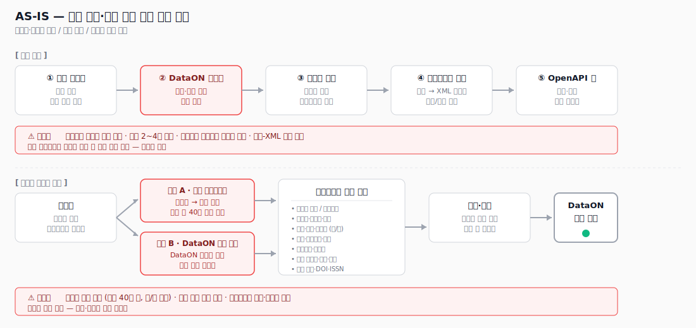
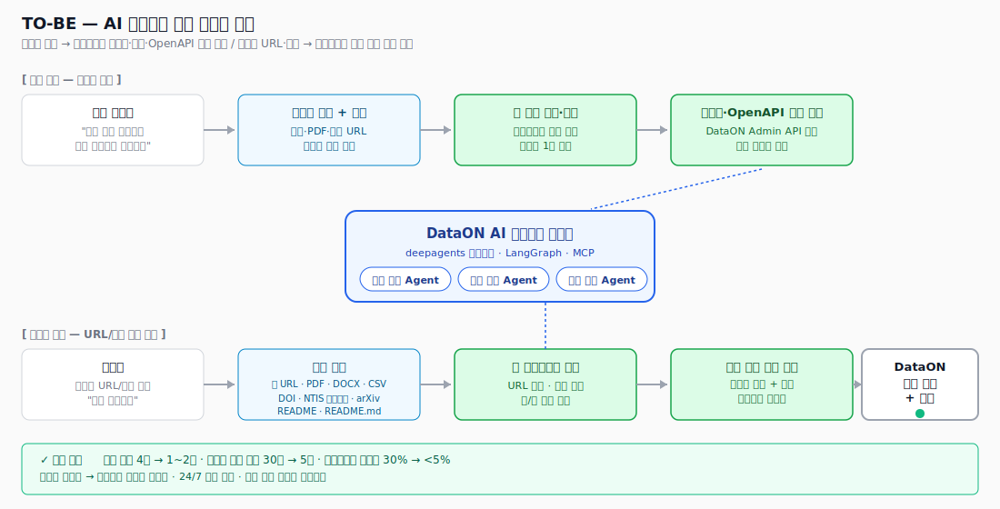
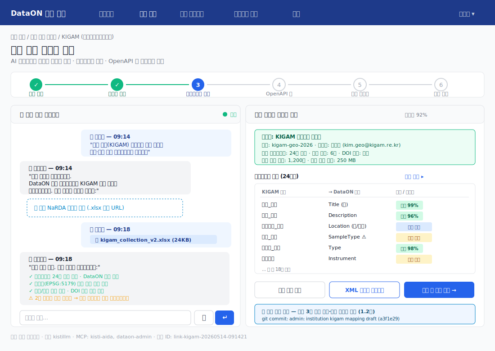
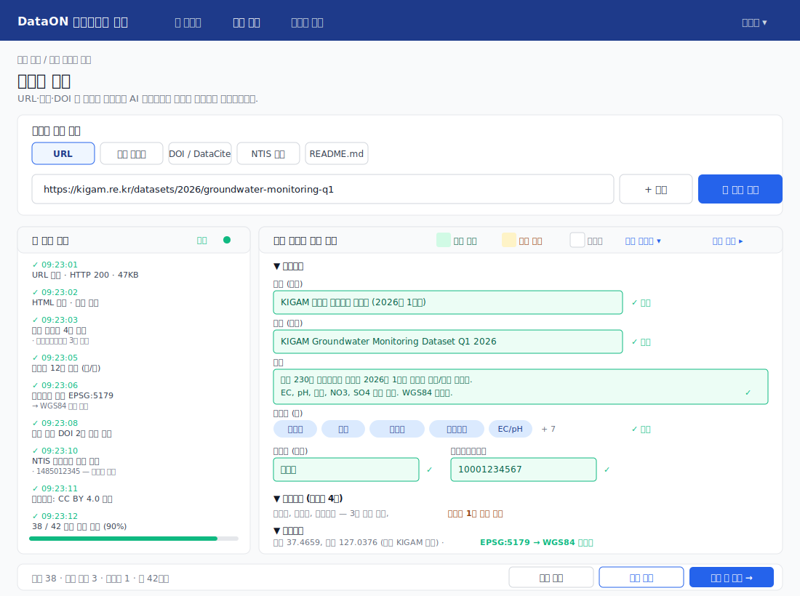
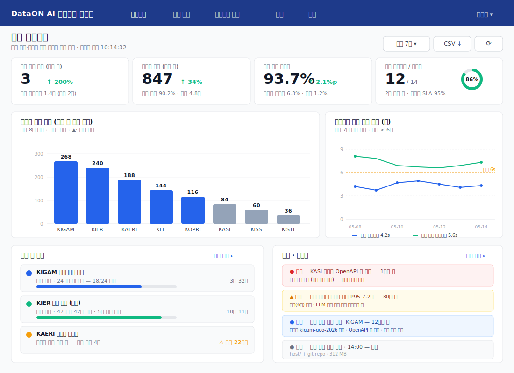

# AI 에이전트 플랫폼 구축 전략 (DataON)

> 연구데이터 법 시행에 따른 기관 연계·데이터 수집 대폭 증가에 대비하여,
> KISTI DataON에 AI 에이전트 플랫폼을 도입하는 전략과 프로토타입 설계.

| 항목 | 내용 |
|------|------|
| 문서 버전 | v1.0 |
| 작성일 | 2026-05-14 |
| 작성자 | KISTI / DataON 운영팀 |
| 대상 시스템 | [국가연구데이터플랫폼 DataON](https://dataon.kisti.re.kr) · [NaRDA](https://nardar.kisti.re.kr) |
| AI 플랫폼 후보 | [03-sandbox-absolute-path](../README.md) (deepagents + LangGraph + Docker 샌드박스) |

---

## 1. 개요

### 1.1 배경

- **연구데이터 법 제정**에 따라 국가 R&D 산출 연구데이터의 등록·공개·재활용 의무가 강화되었습니다.
- 향후 1~2년 내 연계 기관 수와 등록 건수가 **수 배~수십 배** 증가할 것으로 예상되며, 현재 수작업 중심 운영 체계로는 처리 한계가 명확합니다.
- DataON 운영팀의 인력·시간 자원을 늘리지 않고 **자동화·자기복제 가능한 운영 체계**가 필요합니다.

### 1.2 추진 목표

| 지표 | AS-IS | TO-BE (목표) |
|------|-------|-------------|
| 신규 기관 연계 소요 기간 | 2~4주 | **1~2일** |
| 연구자 1건 등록 시간 | 평균 30분 | **5분 이내** |
| 메타데이터 누락률 | 약 30% | **5% 미만** |
| 24/7 무인 처리 비율 | 0% | **80% 이상** |
| 작업자 수 동일 대비 처리량 | 1배 | **10배 이상** |

### 1.3 적용 범위

본 전략은 다음 4개 영역에 AI 에이전트를 적용합니다.

1. **기관 연계 자동화** — 담당자 요구사항 → 컬렉션·메타데이터 매핑·OpenAPI 키 자동 생성
2. **연구자 등록 자동화** — URL·문서·DOI → 등록 양식 자동 채움
3. **품질 검토 자동화** — 등록된 데이터 메타데이터 일관성·완전성 자동 검수
4. **운영 모니터링** — 처리 현황·자동 채움 정확도·에이전트 가동률 실시간 추적

---

## 2. 현황 분석 (AS-IS)

### 2.1 전체 흐름



### 2.2 기관 연계 프로세스 (현재)

PPT 자료(`docs/DataON 데이터셋 수집 흐름...pptx`) 기반.

| 단계 | 작업 내용 | 주체 | 소요 |
|------|----------|------|------|
| ① 요건 수집 | 기관 담당자가 자체적으로 컬렉션 요건 정리 (엑셀 양식) | 기관 담당자 | 1~3일 |
| ② 협의 | DataON 작업자가 전화·메일로 반복 검토 | 작업자 + 담당자 | 1~2주 |
| ③ 컬렉션 정의 | NaRDA 리포지터리에 컬렉션 생성·담당자 설정 | DataON 작업자 | 0.5일 |
| ④ 메타데이터 매핑 | 엑셀 정의 → ACOMS 메타데이터 형식(XML 스키마) 변환 | DataON 작업자 | 1~3일 |
| ⑤ OpenAPI 키 발급 | 키 생성, 기관 시스템에 등록, 연계 테스트 | 양측 협력 | 0.5~1일 |

**문제점:**

- 기관마다 협의가 새로 시작되어 노하우가 축적되지 않음
- 작업자 변경 시 노하우 단절 — 동일 기관 재협의 발생
- 엑셀-XML 변환 수기 작업 — 오류 빈발
- 동일 기관에서 컬렉션 변경 시 다시 협의 필요 — 확장성 부족

### 2.3 연구자 등록 프로세스 (현재)

등록 양식(`docs/dataon_register_form.html`) 기반.

| 구분 | 내용 |
|------|------|
| 필드 수 | 약 40개 (필수 약 18개, 옵션 22개) |
| 입력 항목 | 기본정보(과제·컬렉션·제목·설명·키워드 한·영), 인물정보(책임자·참여자·기여자·기관·국가연구자번호), 추가정보(기간·수집지역·좌표·라이선스·엠바고), 관련논문(DOI·ISSN·ISBN), 파일(해시·포맷·크기) |
| 입력 경로 | A. 기관 리포지터리(NaRDA)에 등록 후 DataON 자동 수집, 또는 B. DataON 등록 페이지에서 직접 등록 |
| 입력 시간 | 평균 30~45분/건 (한·영 병기, 좌표·DOI 수기 입력 등) |

**문제점:**

- 동일 정보를 기관 시스템과 DataON에 **중복 입력**해야 함
- 한·영 병기 필요 항목이 많아 부담
- 좌표·DOI·NTIS 과제번호 등 수기 입력 오류 빈발
- 검토자(담당자) 수기 검수 — 품질 일관성 보장 어려움

---

## 3. 목표 모델 (TO-BE)

### 3.1 AI 에이전트 적용 흐름



### 3.2 기관 연계 자동화 — `institution-linking-agent`

**컨셉**: 담당자가 자연어로 요건을 설명하면 에이전트가 컬렉션·메타데이터 매핑·OpenAPI 키까지 자동 생성하고, 담당자는 1회 컨펌만 수행합니다.

| AS-IS 단계 | TO-BE 자동화 |
|-----------|-------------|
| ① 요건 수집 | 담당자가 채팅창에 자유 기술 + 기존 엑셀/PDF/URL 첨부 |
| ② 협의 | 에이전트가 누락 항목 대화형으로 보완 질문 (한 번에 일괄) |
| ③ 컬렉션 정의 | 에이전트가 DataON Admin API로 컬렉션 자동 생성 |
| ④ 메타데이터 매핑 | 첨부 엑셀 → DataON 표준 매핑 자동 생성 (신뢰도 표시) |
| ⑤ OpenAPI 키 | 자동 발급 + 기관 시스템 연결 검증 (샘플 3건 자동 등록/삭제) |

**에이전트 스킬:**
- `parse_excel_collection` — 엑셀 컬렉션 정의 파싱
- `map_metadata_to_dataon_standard` — DataON 표준 메타데이터 매핑
- `generate_xml_schema` — ACOMS XML 스키마 생성
- `dataon_admin_api` — 컬렉션 생성·키 발급 (MCP)
- `validate_with_sample` — 샘플 등록 테스트

### 3.3 연구자 등록 자동화 — `registration-autofill-agent`

**컨셉**: 연구자가 데이터를 가리키는 URL·파일·DOI·NTIS 과제번호 등 **하나만 제공**하면 에이전트가 42개 필드 중 평균 38개를 자동으로 채워 사용자는 검토만 수행합니다.

| 입력 소스 | 추출 가능 정보 |
|----------|---------------|
| 데이터 페이지 URL | 제목(한/영) · 설명 · 키워드 · 책임자 · 라이선스 · 좌표 |
| README.md / 문서 파일 | 데이터 구조 · 컬럼 정의 · 측정 단위 · 수집 기간 |
| DOI (DataCite) | 모든 표준 메타데이터 일괄 |
| NTIS 과제번호 | 책임자 · 기관 · 과제 기간 · 키워드 |
| arXiv / Crossref 논문 DOI | 관련 논문 자동 매칭 |

**에이전트 스킬:**
- `fetch_url_metadata` — URL 파싱 (HTML/JSON-LD/OG 태그)
- `parse_readme` — README.md 자동 해석
- `lookup_doi_datacite` — DataCite·Crossref 메타데이터 조회
- `lookup_ntis_project` — NTIS API 과제 정보 조회
- `lookup_national_researcher_id` — 국가연구자번호 자동 매칭
- `transform_coordinates` — 좌표계 변환 (EPSG → WGS84)
- `translate_korean_english` — 한/영 자동 병기

각 자동 채움 항목은 **신뢰도 점수(%)** 와 **근거(출처 URL/필드)** 를 함께 표시하여 검토를 돕습니다.

### 3.4 품질 검토 자동화 — `quality-review-agent`

**컨셉**: 등록 신청 시 에이전트가 메타데이터 일관성·완전성을 사전 검수하여 담당자 부담을 경감합니다.

- 필수 필드 누락 / 한·영 불일치 / 좌표 범위 이상 / 키워드 중복 자동 탐지
- 동일 책임자의 기존 등록 데이터와 비교한 일관성 검사
- 라이선스 정책 위반 / 민감정보(개인정보·지적재산) 자동 탐지

---

## 4. 프로토타입 화면 설계

### 4.1 기관 연계 설정 화면



**구성:**
- **상단 stepper** — 요건 수집 → 컬렉션 정의 → 메타데이터 매핑 → OpenAPI 키 → 연계 테스트 → 운영 전환 (6단계)
- **좌측 채팅 패널** — 담당자와 에이전트의 대화. 파일 첨부, 보완 질문, 진행 상태 표시
- **우측 자동 생성 미리보기** — 에이전트가 생성한 컬렉션 요약, 매핑 테이블 (자동/변환규칙/확인필요 색상 구분), 사전 검증 결과
- **하단 액션** — 매핑 수동 편집, XML 스키마 미리보기, 확인 후 다음 단계

**사용자 동선 (담당자 관점):**
1. "신규 기관 연계" 메뉴 클릭 → 기관 정보 입력
2. 채팅창에 "우리 기관 컬렉션 만들어줘" + 엑셀 첨부
3. 에이전트가 분석 후 우측에 매핑안 표시 → 모호 필드 2개에 대해 추가 질문
4. 담당자가 답변 → 매핑 확정
5. "다음 단계"로 진행 → OpenAPI 키 발급, 샘플 등록 테스트
6. 모든 단계 통과 후 운영 전환

### 4.2 연구자 등록 자동 채우기 화면



**구성:**
- **상단 데이터 소스 입력** — URL · 파일 업로드 · DOI · NTIS 과제번호 · README.md 탭. 단일 호출로 여러 소스 동시 입력 가능
- **좌측 추출 진행 로그** — 단계별 처리 상태 (HTTP 접근, HTML 파싱, 좌표 변환, 논문 매칭 등)와 결과 요약
- **우측 자동 채워진 양식** — 42필드 중 자동 채움/확인 필요/미채움을 색상으로 구분 (녹/노/회). 신뢰도 표시
- **하단 액션** — 자동 38 · 확인 3 · 미채움 1 요약, 다시 분석 / 임시 저장 / 검토 후 제출

**사용자 동선 (연구자 관점):**
1. "신규 등록" 메뉴 → 자동 채우기 모드 진입
2. 데이터 페이지 URL 한 줄 입력 → "분석 시작"
3. 10~30초 대기 후 양식이 채워진 상태로 표시됨
4. 노란색(확인 필요) 항목 3개만 검토·수정
5. "검토 후 제출" → 품질 검토 에이전트가 사전 검수 → DataON 등록 완료

### 4.3 사용자 시나리오 — 한 번에 연결되는 흐름

```
연구자                  AI 에이전트                  DataON
─────                  ─────────                   ──────
"이거 등록해줘"     →   ① URL 수집 (HTTP)
+ URL 1줄             ② HTML/메타데이터 추출
                       ③ DOI·NTIS 외부 조회 (MCP)
                       ④ 좌표·번역 변환
                       ⑤ 42필드 중 38필드 채움      →  품질 검토 에이전트
                                                       ⑥ 사전 검수 통과
                       ⑦ 사용자 확인 요청          ←
검토·수정 3필드   →   ⑧ 최종 등록 API 호출        →  ⑨ 등록 완료 + DOI 발급
                       ⑩ 알림 (메일/슬랙)
```

---

## 5. AI 에이전트 플랫폼 구성

### 5.1 deepagents 샌드박스 적용 모델

[03-sandbox-absolute-path](../README.md) 프로젝트를 기반으로 다음과 같이 매핑합니다.

| deepagents 구성 요소 | DataON 적용 |
|---------------------|------------|
| `host/{profile}/` | 업무 영역별 에이전트 프로파일 |
| `host/shared/skills/` | 공통 스킬 (workspace-awareness, dataon-api, kisti-mcp) |
| `host/data_pipeline/skills/` | 기관별 데이터 수집·변환 스킬 (kaeri, kfe, kier, kigam, kopri, ...) |
| `host/{profile}/subagents/` | 특화 작업 서브에이전트 |
| `AdvancedDockerSandbox` | 외부 데이터 접근·코드 실행 격리 컨테이너 |

### 5.2 에이전트 프로파일 정의

```
host/
├── shared/                          # 공통 (모든 에이전트 노출)
│   └── skills/
│       ├── workspace-awareness/     # 작업공간·경로 규칙
│       ├── dataon-api/              # DataON Admin/Submit API (MCP)
│       └── kisti-mcp/               # KISTI AIDA·ScienceON·DataON 조회
│
├── data_pipeline/                   # 기관별 수집 스킬 (서브에이전트 선택 노출)
│   └── skills/
│       ├── kaeri/                   # 한국원자력연구원
│       ├── kfe/                     # 한국핵융합에너지연구원
│       ├── kier/                    # 한국에너지기술연구원
│       ├── kigam/                   # 한국지질자원연구원
│       └── kopri/                   # 극지연구소
│
├── institution-linking/             # 기관 연계 프로파일
│   ├── AGENTS.md                    # 시스템 프롬프트
│   ├── config.json                  # LLM 설정 (kistillm)
│   ├── tools.json                   # MCP: dataon-admin, narda-api
│   ├── skills/
│   │   ├── parse-excel-collection/
│   │   ├── map-metadata/
│   │   ├── generate-xml-schema/
│   │   └── validate-with-sample/
│   └── subagents/
│       ├── excel-parser/            # 엑셀 컬렉션 정의 전담
│       └── schema-generator/        # ACOMS XML 스키마 생성 전담
│
├── registration-autofill/           # 연구자 등록 자동화 프로파일
│   ├── AGENTS.md
│   ├── config.json
│   ├── tools.json                   # MCP: doi, datacite, ntis, scienceon
│   ├── skills/
│   │   ├── fetch-url-metadata/
│   │   ├── parse-readme/
│   │   ├── lookup-doi/
│   │   ├── lookup-ntis/
│   │   ├── lookup-researcher-id/
│   │   ├── transform-coordinates/
│   │   └── translate-ko-en/
│   └── subagents/
│       ├── url-analyzer/            # 웹 페이지 분석 전담
│       ├── doc-parser/              # 첨부 파일(PDF/DOCX/CSV) 파싱
│       └── translator/              # 한/영 번역 전담
│
└── quality-review/                  # 품질 검토 프로파일
    ├── AGENTS.md
    ├── config.json
    ├── tools.json
    └── skills/
        ├── check-metadata-completeness/
        ├── check-license-policy/
        ├── detect-pii/              # 개인정보 자동 탐지
        └── cross-check-history/     # 동일 책임자 과거 등록과 일관성 확인
```

### 5.3 MCP 도구 (`tools.json` 정의 예)

| MCP 서버 | 용도 | 제공 도구 (예) |
|---------|------|---------------|
| `dataon-admin` | DataON 관리 API | `create_collection`, `issue_openapi_key`, `submit_record`, `update_schema` |
| `narda-api` | NaRDA 리포지터리 API | `list_collections`, `register_metadata_schema` |
| `datacite` | DOI 메타데이터 조회 | `lookup_doi`, `search_dataset` |
| `ntis` | NTIS 과제 정보 | `lookup_project`, `get_researcher` |
| `scienceon` | KISTI ScienceON | `search_papers`, `match_paper_by_title` |
| `kisti-aida` | KISTI AIDA (LLM·번역) | `translate`, `summarize`, `classify` |

### 5.4 데이터 흐름

```
            ┌────────────────────────────────────────────────────────┐
            │  웹 UI (관리 콘솔 / 연구자 등록 페이지)                  │
            └───────┬────────────────────────────────────────────────┘
                    │ REST + SSE
                    ▼
            ┌────────────────────────────────────────────────────────┐
            │  Admin API (FastAPI :8080) — ADMIN_UI_DESIGN.md 참조    │
            │  ├─ /api/v1/agents/{profile}/chat                      │
            │  ├─ /api/v1/registration/autofill                      │
            │  └─ /api/v1/quality/review                             │
            └───────┬────────────────────────────────────────────────┘
                    │
                    ▼
            ┌────────────────────────────────────────────────────────┐
            │  LangGraph dev :2024 — agent_server.py                 │
            │  ├─ sandbox-institution-linking                        │
            │  ├─ sandbox-registration-autofill                      │
            │  └─ sandbox-quality-review                             │
            └───────┬────────────────────────────────────────────────┘
                    │ create_deep_agent + Skills + MCP
                    ▼
        ┌───────────┴───────────┐
        ▼                       ▼
   AdvancedDockerSandbox    MCP 서버 (dataon-admin, datacite, ntis, ...)
   (격리 코드 실행)              (외부 메타데이터 조회·등록 API)
```

---

## 6. 플랫폼 관리·모니터링

### 6.1 모니터링 화면



### 6.2 KPI 정의

| 영역 | 지표 | 산출 방식 | 목표 |
|------|------|----------|------|
| 처리량 | 신규 기관 연계 수 / 주 | 완료 thread 수 | 3건 이상 |
| 처리량 | 데이터 등록 건수 / 주 | 등록 성공 수 | 1,000건 이상 |
| 품질 | 자동 채움 정확도 | 1 − (사용자 수정 필드 / 자동 채움 필드) | 90% 이상 |
| 품질 | 등록 후 반려율 | 반려 / 제출 | 5% 미만 |
| 응답성 | 등록 에이전트 P95 응답시간 | LangGraph thread 종료 시각 - 시작 시각 | 6초 이내 |
| 가용성 | 에이전트 가용률 | (활성 시간 / 전체 시간) | 95% 이상 |

### 6.3 관리 화면 구성

웹 기반 통합 관리 콘솔(기존 [ADMIN_UI_DESIGN.md](ADMIN_UI_DESIGN.md) 확장)에서 다음을 수행합니다.

| 화면 | 기능 |
|------|------|
| 운영 대시보드 (위 SVG) | KPI · 기관별 현황 · 응답시간 추이 · 진행 중 작업 · 알림 |
| 기관 연계 콘솔 | 기관별 컬렉션 정의·매핑·OpenAPI 키 관리 |
| 에이전트 관리 | 프로파일 CRUD · 스킬·MCP 도구·서브에이전트 편집 (버전 관리: git) |
| 로그 | LangGraph 스레드 실행 이력 · 도구 호출 시퀀스 · Docker 로그 |
| 워크스페이스 | 컨테이너 작업 디렉토리 조회 |
| 알림 설정 | 임계치 초과 시 Slack/메일 알림 (에이전트 오류·키 만료·응답 지연) |

### 6.4 운영 자동화

- **상태 변화 알림**: KASI OpenAPI 키 만료 7일 전 자동 통보 → 갱신 절차 안내
- **품질 임계치 알림**: 자동 채움 정확도 7일 이동평균 85% 미만 시 운영자 알림
- **세션 트레이스**: 모든 에이전트 대화는 LangSmith로 자동 전송 (`.env LANGSMITH_PROJECT` 설정)
- **백업**: `host/` + git repo + workspace 일일 백업 (자정 + 일주일 보관)

---

## 7. 단계별 추진 계획

### Phase 1 — 기관 연계 PoC (4~6주)

> 목표: 1개 기관(KIGAM 또는 KIER)에 대해 챗봇형 컬렉션 셋업 시연

- 기관 연계 프로파일·서브에이전트·스킬 작성
- DataON Admin API MCP 서버 작성 (read-only 부터)
- 채팅 UI 프로토타입 (단일 페이지)
- 1개 기관 컬렉션 정의 자동 생성 → 운영팀 검토 후 수동 등록

### Phase 2 — 연구자 등록 자동화 (6~8주)

> 목표: 자동 채움 모드를 DataON 등록 페이지 옵션으로 제공

- 등록 자동화 프로파일·스킬·MCP (DataCite, NTIS, ScienceON, Crossref)
- 등록 페이지에 "자동 채우기" 모드 추가 (기존 양식과 병존)
- 신뢰도·근거 표시 UI
- 5개 기관 대상 베타 운영 → 자동 채움 정확도 측정

### Phase 3 — 품질 검토 + 모니터링 (4주)

> 목표: 검수 부담 절감, 운영 가시성 확보

- 품질 검토 에이전트 작성
- 운영 대시보드 구축 (위 SVG 기준)
- 알림·KPI 자동 산출 파이프라인

### Phase 4 — 확장·표준화 (지속)

> 목표: 신규 기관 자기복제 온보딩

- 기관 연계 에이전트가 새 기관 추가 시 기존 노하우 재사용
- 등록 자동화 정확도 95% 달성
- 운영팀 1인이 수십 기관 동시 운영 가능한 수준

### 7.1 일정 (예시)

```
2026-06  Phase 1 시작 (기관 연계 PoC)
2026-07  Phase 1 종료 / Phase 2 시작
2026-08  ─
2026-09  Phase 2 종료 / Phase 3 시작
2026-10  Phase 3 종료
2026-11~  Phase 4 지속 운영·확장
```

---

## 8. 위험 및 대응

| 위험 | 영향 | 대응 |
|------|------|------|
| LLM 환각으로 잘못된 메타데이터 자동 채움 | 데이터 품질 저하 | 신뢰도 표시, 사용자 검토 의무화, 품질 검토 에이전트 이중 검증 |
| 외부 API(NTIS, DataCite) 장애 | 자동 채움 실패 | 캐싱·재시도·우회 (DOI → 직접 페이지 파싱) |
| 민감정보(개인정보) 자동 등록 | 법적 리스크 | PII 자동 탐지 스킬, 의심 항목 사용자 컨펌 의무화 |
| LLM API 비용 증가 | 운영비 부담 | 프롬프트 캐싱, 경량 모델 분기, 일일 비용 모니터링 |
| 에이전트 코드 변경으로 운영 중단 | 서비스 영향 | git 기반 버전 관리, 단계적 배포(canary), 자동 롤백 |
| 보안 사고 (admin API 노출) | 시스템 침해 | 내부망 + Bearer 인증 + 감사 로그 (ADMIN_UI_DESIGN.md §13 참조) |

---

## 9. 기대 효과

| 영역 | 효과 |
|------|------|
| **처리량 확대** | 인력 동일 대비 10배 이상 처리, 연구데이터 법 시행 대응 |
| **품질 향상** | 자동 채움·검수로 메타데이터 누락률 30% → 5% 미만 |
| **연구자 경험** | 등록 시간 30분 → 5분, 한/영 병기 부담 제거 |
| **운영 효율** | 24/7 무인 운영 80% 이상, 작업자 노하우의 스킬화 |
| **확장성** | 신규 기관 자기복제 온보딩, 표준화·정책 통일 |
| **데이터 자산화** | DataON 등록 데이터 일관성 향상 → 재활용·분석 용이 |

---

## 10. 참고

| 문서 | 설명 |
|------|------|
| [README.md](../README.md) | DataON Sandbox 프로젝트 개요 |
| [docs/DEPLOYMENT.md](DEPLOYMENT.md) | 운영 배포·systemd·Nginx |
| [docs/ADMIN_UI_DESIGN.md](ADMIN_UI_DESIGN.md) | 관리자 Web UI 설계 (FastAPI + React) |
| [docs/dataon_register_form.html](dataon_register_form.html) | 현행 연구데이터 등록 양식 |
| [docs/DataON 데이터셋 수집 흐름(기관 저장소 연계 및 직접 등록).pptx](.) | 현행 수집 흐름 (PPT) |
| [host/shared/skills/workspace-awareness/SKILL.md](../host/shared/skills/workspace-awareness/SKILL.md) | 샌드박스 작업공간 규칙 |
| LangGraph | https://langchain-ai.github.io/langgraph/ |
| deepagents | https://github.com/langchain-ai/deepagents |
| MCP Spec | https://modelcontextprotocol.io |

---

## 부록 A — 화면 자료 일람

| # | 화면 | 파일 |
|---|------|------|
| A.1 | AS-IS 수집 흐름 | [`images/dataon-as-is-flow.svg`](images/dataon-as-is-flow.svg) |
| A.2 | TO-BE 자동화 흐름 | [`images/dataon-to-be-flow.svg`](images/dataon-to-be-flow.svg) |
| A.3 | 기관 연계 설정 화면 | [`images/dataon-institution-linking-screen.svg`](images/dataon-institution-linking-screen.svg) |
| A.4 | 연구자 등록 자동 채우기 화면 | [`images/dataon-registration-autofill-screen.svg`](images/dataon-registration-autofill-screen.svg) |
| A.5 | 플랫폼 모니터링 화면 | [`images/dataon-platform-monitoring.svg`](images/dataon-platform-monitoring.svg) |
